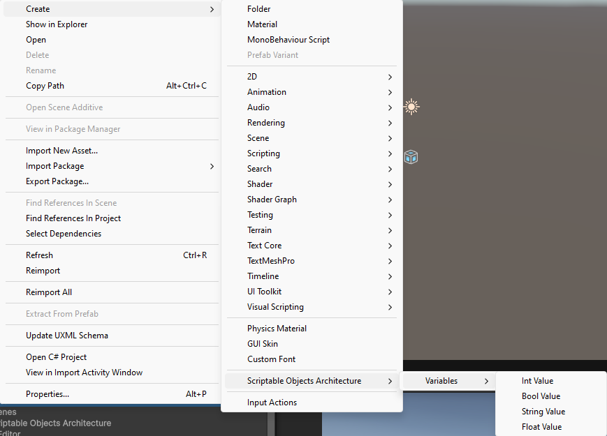

# Scriptable Object Architecture for Unity

[](https://opensource.org/licenses/MIT)

## Overview

This Unity package provides a foundational implementation of the Scriptable Object Architecture pattern, heavily
inspired by Ryan Hipple's talk "Unite Austin 2017 - Game Architecture with Scriptable Objects" and similar concepts
promoting decoupled and modular game development.

The core idea is to use Scriptable Objects not just for data storage, but as communication channels and shared state
containers, significantly reducing direct dependencies between different parts of your game.

**Inspiration:**

* [Unite Austin 2017 - Game Architecture with Scriptable Objects (Ryan Hipple)](https://www.youtube.com/watch?v=raQ3iHhE_Kk)
* [Unity Scriptable Object Game Events (Similar Concepts)](https://www.youtube.com/watch?v=bO8WOHCxPq8)

This package currently provides:

* **Variables:** Scriptable Objects representing shared primitive data types (Bool, Int, Float, String).
* **References:** A helper class allowing components to flexibly reference either a constant value or a Variable asset
  directly in the Inspector.
* **Automatic Runtime Resets:** Ensures Variables reset to their initial values when entering Play mode or before a
  scene loads.
* **Build Preprocessor Resets:** Ensures Variables are reset to their initial values before a build is made.
* **Custom Editor Drawers:** Enhanced Inspector UI for References.

## Features

* **Decoupling:** Reduce hard references between MonoBehaviours. Components interact indirectly through Scriptable
  Object assets.
* **Modularity:** Systems can be added or removed more easily.
* **Designer Friendly:** Allows designers to tweak values and hook up logic via the Inspector without code changes.
* **Runtime Flexibility:** Variables can be observed for changes, allowing reactive UI or game logic.
* **Predictable State:** Automatic reset mechanisms ensure consistent starting states during development and in builds.

## Installation

**Using Unity Package Manager (Recommended)**

1. Open your Unity project.
2. Go to `Window` > `Package Manager`.
3. Click the `+` button in the top-left corner.
4. Select `Add package from git URL...`.
5. Enter the repository URL: `https://github.com/lfeq/Scriptable-Objects-Architecture.git`
6. Click `Add`. Unity will download and import the package.

## How to Use

### 1. Creating Variables

Variables are Scriptable Object assets that hold a single value.

1. In the Unity Editor's `Project` window, right-click or use the `Assets` menu.
2. Navigate to `Create` > `Scriptable Objects Architecture` > `Variables`.
3. Choose the desired type (`Bool Value`, `Float Value`, `Int Value`, `String Value`).
4. Name the newly created asset (e.g., `PlayerHealth`, `Score`, `IsGameOver`).
5. Select the asset and configure its `Initial Value` in the Inspector. This value will be used at the start and when
   the asset is reset.



### 2. Using Variables in Scripts

Reference the Variable asset directly in your MonoBehaviours.

``` csharp
using UnityEngine;
using Scriptable_Objects_Architecture.Runtime.Variables; // Import the namespace

public class PlayerStats : MonoBehaviour
{
    public IntVariable scoreVariable; // Assign your "Score" asset in the Inspector
    public FloatVariable healthVariable; // Assign your "PlayerHealth" asset

    void Start()
    {
        // Initialize UI or game state based on initial values
        UpdateScoreUI(scoreVariable.Value);
        UpdateHealthUI(healthVariable.Value);

        // Subscribe to changes (optional)
        scoreVariable.OnValueChange += UpdateScoreUI;
        healthVariable.OnValueChange += UpdateHealthUI;
    }

    void OnDestroy()
    {
        // Unsubscribe to prevent memory leaks
        scoreVariable.OnValueChange -= UpdateScoreUI;
        healthVariable.OnValueChange -= UpdateHealthUI;
    }

    public void AddScore(int amount)
    {
        scoreVariable.Value += amount; // Setting the Value triggers OnValueChange
    }

    public void TakeDamage(float amount)
    {
        healthVariable.Value -= amount;
    }

    void UpdateScoreUI(int newScore)
    {
        Debug.Log("Score Updated: " + newScore);
        // Update your score Text UI element here
    }

    void UpdateHealthUI(float newHealth)
    {
        Debug.Log("Health Updated: " + newHealth);
        // Update your health bar UI element here
    }
}
```

### 3. Using References

References provide flexibility in the Inspector. You can choose whether a field uses a shared `Variable` asset or a
simple constant value.

```csharp
using UnityEngine;
using Scriptable_Objects_Architecture.Runtime.References; // Import the namespace

public class EnemyController : MonoBehaviour
{
    // This can be set to a constant OR link to a FloatVariable in the Inspector
    public FloatReference moveSpeed;

    // This will likely always be linked to the PlayerHealth Variable asset
    public FloatReference playerHealthTarget;

    void Update()
    {
        // Access the value transparently, regardless of constant or variable
        transform.Translate(Vector3.forward * moveSpeed.Value * Time.deltaTime);

        if (Input.GetKeyDown(KeyCode.Space)) // Example interaction
        {
            // Can modify the referenced Variable if not using a constant
            if (!playerHealthTarget.UseConstant && playerHealthTarget.Variable != null)
            {
                playerHealthTarget.Value -= 10; // Damage the player (example)
                Debug.Log($"Damaged player via Reference. Current Player Health: {playerHealthTarget.Value}");
            }
            else
            {
                 Debug.Log($"Player Health Target is constant or null: {playerHealthTarget.Value}");
            }
        }
    }
}
```

In the Inspector, `FloatReference` (and other Reference types) will show a dropdown:

* **Use Constant:** Allows you to enter a fixed value directly (e.g., `moveSpeed = 5.0f`).
* **Use Variable:** Shows an object field where you can drag & drop a corresponding `Variable` asset (e.g., assign your
  `PlayerHealth` FloatVariable asset to `playerHealthTarget`).


## Core Concepts Explained

* **`RuntimeScriptableObject`:** The base class for Variables. It automatically registers instances and handles
  resetting them to their `initialValue` via `RuntimeInitializeOnLoadMethod(RuntimeInitializeLoadType.BeforeSceneLoad)`.
  This ensures a clean state every time you press Play in the editor.
* **`ResetRuntimeScriptableObjectsBuildPreprocessor`:** An editor script that hooks into the build process (
  `IPreprocessBuildWithReport`). Before a build is made, it finds all `RuntimeScriptableObject` assets in the project
  and calls their `OnReset()` method, ensuring the built game starts with the intended initial values.
* **`OnValueChange` Event:** Each Variable (`BoolVariable`, `FloatVariable`, etc.) exposes a `UnityAction<T>` event.
  Scripts can subscribe to this event to react whenever the Variable's `Value` property is changed.
* **References (`BoolReference`, `FloatReference`, etc.):** These are simple C# classes marked `[Serializable]`. They
  contain fields for `UseConstant`, `ConstantValue`, and the `Variable` asset link. The custom `PropertyDrawer`
  classes (`BoolReferenceDrawer`, etc.) create the user-friendly Inspector UI. Implicit operators allow you to use a
  Reference directly where its underlying type is expected (e.g., `float speed = moveSpeedReference;`).

## Roadmap / Future Plans

This package is intended as a base. Future additions planned include:

* **Game Events:** Implement Scriptable Object based events for further decoupling (e.g., `GameEvent` asset,
  `GameEventListener` component).
* **Enum Variables/References:** Add support for shared Enum states using the same Variable/Reference pattern.

## Contributing

Contributions are welcome! Please fork the repository and submit a pull request with your enhancements or open issues.

## License

This project is licensed under the MIT License - see the [LICENSE.md](LICENSE.md) file for
details.

## Acknowledgements

* **Ryan Hipple** for the foundational talk on Scriptable Object Architecture.
* The Unity community for discussions and variations on these patterns.
